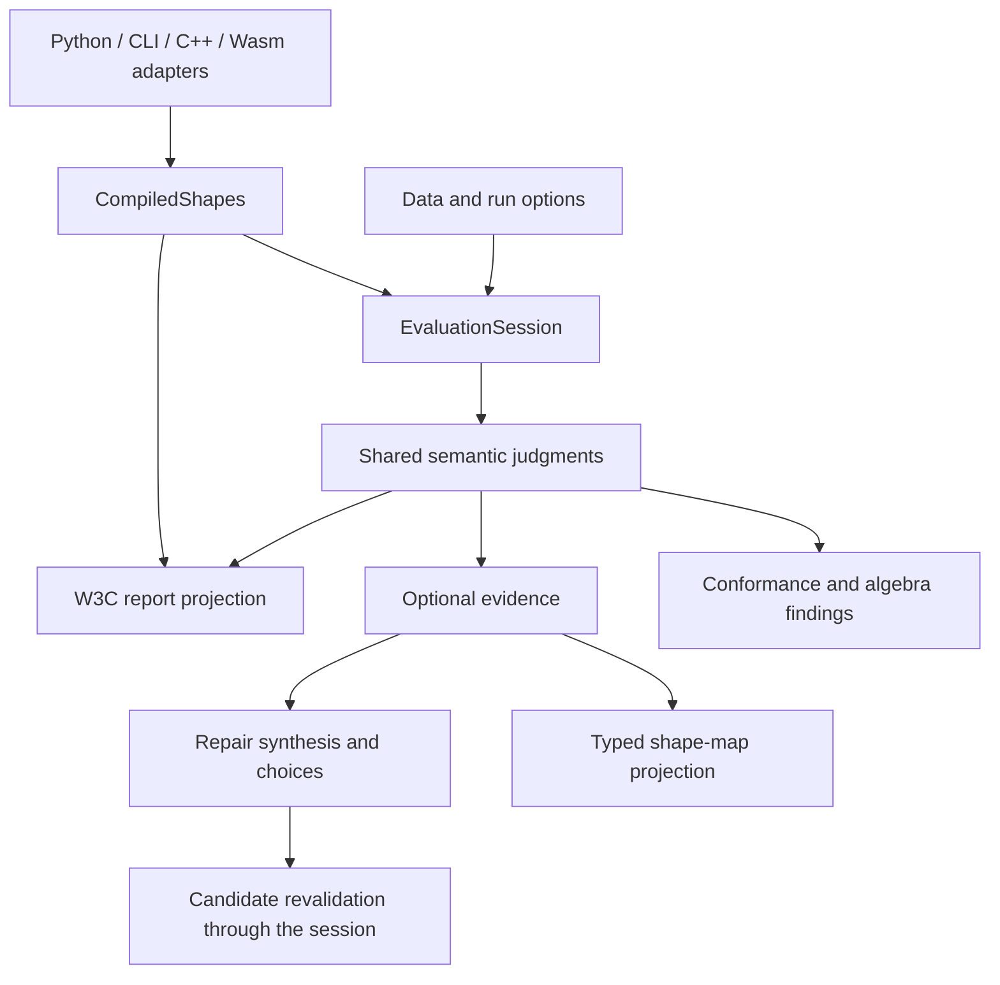

# Architecture and maintainability review for 0.5

Reviewed 2026-09-18 at commit `4118547`.

The core algebra is a useful foundation. The largest maintenance problem is
distributed ownership of execution policy: callers repeatedly assemble a schema,
graphs, inference, SPARQL configuration, and result representations. Some of that
duplication already changes answers between APIs. The highest-value improvement
is to put those decisions behind a small shared Rust interface.

This review covers the tracked Rust crates, Python package and native extension,
C/C++ adapter, Wasm adapter, relevant tests, and architecture documentation. It
is an architectural review with focused runtime checks, not an exhaustive audit
of every algorithm or the entire release test matrix. Existing untracked data,
examples, and worktrees were excluded. No implementation files were changed.

## Findings

### 1. P1: W3C reporting owns a second validation engine

**Locations:** `crates/shifty-engine/src/report.rs:1`, `:847`, `:2002`;
`crates/shifty-engine/src/validate.rs:487`, `:856`;
`docs/explanation/architecture.rst:148`.

`Reporter::collect`, `value_checks`, and `conforms` recursively interpret SHACL
RDF, including logical operators, qualified counts, target selection, and
recursion. They share leaf primitives with algebraic validation but do not use
`ShapeEvaluator` for their semantic decisions. Consequently, changes to a
constraint's behavior can require changes to lowering, algebra evaluation, and
the RDF reporter. The architecture documentation explicitly says there is no
second implementation; the implementation contradicts that claim.

**Observed consequence:** for a shape targeting `ex:x` with `sh:not ex:S` referring
to itself, Python `validate(..., infer=False)` returns nonconforming. Algebraic
validation and evidence reject the schema as non-stratifiable. The W3C path does
not enforce the same recursion admission rule. This also occurs with default
inference enabled when there are no rules, since inference is skipped.

**Recommendation:** first give every public path the same schema admission
checks. Then make source-oriented reporting consume judgments from the shared
evaluator. Keep W3C component boundaries and authored provenance in compilation
metadata. A normalized `Reason` alone cannot reconstruct all W3C report fields;
simply replacing the reporter with a serialization of algebra violations would
lose information. Refactor component by component, with comparison tests.

**Release decision:** fix the admission mismatch and the documentation for 0.5.
Unifying the full reporter is a substantial project that can follow in stages.

### 2. P1: Graph-mode assembly is duplicated and already inconsistent

**Locations:** `crates/shifty-engine/src/validate.rs:427`, `:637`;
`crates/shifty-engine/src/evidence.rs:163`;
`crates/shifty-engine/src/report.rs:146`, `:207`.

The same `Data` / `Union` / `UnionAll` selection and frozen-dataset construction
appears in schema validation, planned validation, evidence, W3C reporting, and
property witnesses. These operations need three distinct roles: the graph used
to select focus nodes, the default graph used for evaluation, and the named
shapes graph used by `$shapesGraph`.

**Observed consequence:** in `UnionAll`, algebra/evidence put the union into the
named shapes-graph slot. W3C reporting retains the actual shapes graph in that
slot. A constraint querying `$shapesGraph` for a triple that exists only in the
data graph therefore fails through algebra/evidence and passes through W3C.

**Recommendation:** one internal execution-context constructor should own graph
roles and indexing for all consumers. Its interface should take explicit data,
shapes, and mode inputs; callers should not decide which graph to mirror into a
named slot. Preserve the distinction between embedded and split inputs. Test all
three graph modes with `$shapesGraph` and target selection across interfaces.

### 3. P1: SPARQL function setup and feature policy have no single owner

**Locations:** `crates/shifty-engine/src/report.rs:288`, `:606`;
`crates/shifty-engine/src/infer.rs:132`, `:477`;
`crates/shifty-engine/src/validate.rs:510`, `:718`;
`python/src/lib.rs:721`, `:736`, `:1529`.

Report validation registers SHACL functions, inference has its own function
collector, and algebra/evidence construct SPARQL executors without registering
the functions. The report collector canonicalizes function bodies using loaded
prefixes; the inference collector reads raw bodies. This is semantic preparation
distributed across execution consumers.

**Observed consequence:** a pure `ex:isOk` SHACL function called by a constraint
passes for the value `"ok"` through W3C validation. Algebra/evidence fail that
same focus; the algebra reason says the custom function is unsupported.

There is a second policy leak in the Python adapter: `maybe_infer` and
`maybe_infer_embedded` call inference with default options, although the enclosing
validation call accepts `on_unsupported`. In a focused rule example, standalone
`infer(on_unsupported="error")` derives zero triples and reports the unsupported
function. `validate(on_unsupported="error", in_place=True)` derives and writes
one triple using the default lenient policy.

**Recommendation:** compile function definitions once alongside the schema and
configure every executor from that registry and an explicit engine policy.
Thread that same policy through automatic inference. Preserve diagnostics when
inference is a substep of validation. The immediate fixes are small enough for
0.5; the shared preparation object in finding 4 should prevent recurrence.

### 4. P2: Compilation and dataset preparation lack a shared lifecycle

**Locations:** `python/src/lib.rs:699`, `:1267`, `:1554`;
`cpp/src/lib.rs:603`, `:778`;
`crates/shifty-wasm/src/lib.rs:183`, `:230`, `:334`;
`crates/shifty-engine/src/evidence.rs:44`, `:199`;
`python/src/repair.rs:2280`, `:2410`.

Each adapter assembles parsing, validity checks, normalization, planning, and
inference. Python's prepared validator retains a normalized schema and plan;
C++ retains raw and normalized schemas and a plan; the Rust evidence preparer
couples schema compilation to a particular data snapshot. Evidence revalidation
therefore normalizes the unchanged schema again. Python additionally clones the
prepared schema and retains it alongside the preparer's own copy.

There is avoidable work in simpler paths too: `load_validation_inputs` always
builds a physical validation plan, and `_infer` immediately discards it. W3C
validation also receives preparation products that its RDF evaluator does not
use. Prepared W3C calls rebuild reporter shape metadata on each data graph.

**Recommendation:** establish two lifetimes behind a shared Rust facade:

- `CompiledShapes`: validated source schema, normalized execution schema,
  source mappings, function registry, and reusable planning products.
- `EvaluationSession`: a compiled-shapes reference, graph roles, inferred
  snapshot, indexes, and snapshot-dependent query/evaluation state.

Compile data-independent state once; rebuild data-dependent state after edits.
Keep data-sensitive SPARQL planning with the session. Raw and normalized schemas
serve different purposes and should remain available; the problem is repeated
ownership and reconstruction of the same representations.

### 5. P2: The Rust API exposes an implementation-choice matrix

**Locations:** `crates/shifty-engine/src/lib.rs:45`;
`crates/shifty-engine/src/validate.rs:388`, `:487`, `:589`, `:695`;
`crates/shifty-engine/src/evidence.rs:884`.

Schema and plan validation each expose seven variants for defaults, graph mode,
options, and context. Evidence adds seven free-function variants, besides its
prepared object. Inference adds borrowed/owned context variants. Callers must
understand execution plumbing to select an operation, and defaults are repeated
through delegation chains.

The duplication also reaches the implementation: `validate_with_frozen` and
`validate_plan_with_frozen` repeat stratification, statement selection, profiling,
explanation, severity aggregation, sorting, and result construction. Their main
difference is focus enumeration.

**Recommendation:** expose one recommended compilation/session path and a small
options object per operation. Make convenience functions delegate to it. Share
the validation driver while keeping schema and planned focus enumeration
explicit. Preserve a way for differential tests and `inspect` to access the raw
and planned stages. Existing exported helpers can remain compatibility wrappers;
removing them is not required to improve the architecture.

### 6. P2: Shape maps duplicate domain logic across language bindings

**Locations:** `python/shifty/shapemap.py:1`;
`cpp/src/shapemap.rs:1`;
`python/src/repair.rs:2947`, `:2980`;
`cpp/src/lib.rs:835`, `:866`, `:986`.

The C++ adapter explicitly describes its shape-map implementation as a port of
the Python algorithm. Both interpret path/qualifier structure, group property
obligations, extract bindings, and handle partial failures. The implementations
are approximately 1,270 lines each, including their data models and formatting.
Binding-name/value lookup is duplicated in the Rust adapter layers as well.

The C++ implementation even serializes an engine run and then reads its JSON
back as `serde_json::Value` to perform domain computation inside Rust. Python
likewise interprets the serialized representation. A change to evidence or
property grouping must propagate across these implementations.

**Recommendation:** one typed Rust shape-map projection should own these rules,
using `Path`, RDF terms, evidence, and provenance directly. Adapters should expose
the results in their language's natural containers. Preserve Python's lazy
lookup and C++'s standalone eager results as adapter choices over the same
projection primitives. Do not force all users to materialize every binding.

### 7. P2: Evidence results retain overlapping representations eagerly

**Locations:** `python/src/repair.rs:2002`, `:2219`, `:2652`, `:2672`;
`cpp/src/lib.rs:986`, `:1047`.

Python `build_run` first serializes the entire evidence run, then constructs a
Python object graph that retains the typed evidence in its wrapper objects.
`to_compact_json` subsequently parses the stored JSON back into a generic tree
before compacting it. C++ also retains serialized runs and reparses them for
shape-map construction. Serialization is consequently part of ordinary in-process
computation, even for callers that never ask for JSON.

**Recommendation:** retain one authoritative typed run with inexpensive views
for lookups. Generate JSON and compact output on demand, optionally caching them.
Python's `InferResult` already demonstrates lazy serialization with `OnceLock`.
The compact wire format itself is useful; avoid changing it merely to refactor
internal ownership. This finding identifies structural allocation/work costs;
no new memory or latency benchmark was performed during this review.

### 8. P3: Shared report rendering is copied into adapters

**Locations:** `python/src/lib.rs:805`;
`cpp/src/lib.rs:1129`;
`crates/shifty-wasm/src/lib.rs:473`.

These are three near-identical W3C text report formatters, including term/severity
rendering and message layout. They have already drifted: Python and Wasm append
SPARQL diagnostics; the C++ formatter does not. Algebra text output has separate
frontend implementations too, although some differences there are intentional.

**Recommendation:** extract the common W3C text renderer and SPARQL diagnostic
renderer into Rust code shared by the adapters. Keep deliberate CLI grouping and
browser presentation decisions at their respective boundaries. Splitting large
files without removing this ownership duplication would produce a smaller
cosmetic benefit.

## Architecture to aim for



These are ownership boundaries, not a proposal to create a crate for every box.
The facade should own sequencing and policy; normalization, inference, path
execution, evidence construction, and repair should remain substantial internal
modules with narrow contracts. Compilation must retain enough source-component
metadata for W3C reporting and property bindings.

Several existing boundaries should be preserved:

- The small shape/path algebra and normalization maps provide a useful common
  representation and explicit source provenance.
- `PathBackend` lets graph and indexed storage share traversal semantics.
- The private SPARQL facade hides native execution and fallback; its differential
  checks are valuable. A second executor for performance is justified here.
- Conformance scanning and optional evidence materialization have different cost
  profiles. Keep that distinction instead of forcing full evidence into a bool
  query.
- Repair templates/instantiation are separate from engine-dependent synthesis
  and revalidation. The small `shifty-repair` crate has a coherent responsibility.
- Source and normalized identities are genuinely different. Keep their mapping
  explicit; do not merge them just to reduce the number of structs.

## Suggested sequence

1. **Before 0.5 final:** add cross-interface regression cases for the four
   reproduced behaviors below; fix common schema admission, graph roles, function
   registration, and policy propagation. Correct the architecture claims.
2. **Establish the shared facade:** extract compiled-shapes ownership and session
   preparation; route adapters through it without changing public results.
   Consolidate the duplicated validation driver and retain old convenience
   functions as thin compatibility wrappers.
3. **Move projections into shared Rust code:** shape-map semantics and common text
   rendering. Make JSON an output boundary and preserve lazy evidence access.
4. **Migrate W3C semantics incrementally:** retain authored component metadata,
   consume shared evaluator judgments, and remove the corresponding RDF semantic
   branches only after differential coverage establishes equivalence.

The release should not depend on completing a wholesale W3C rewrite. The
reproduced discrepancies should be addressed before claiming equivalent behavior
across the interfaces.

## Verification and reproducible examples

Ran `uv sync --dev --frozen` from `python/`, which rebuilt the local extension.
Then ran the locked environment's pytest on `tests/test_errors.py`,
`tests/test_shacl_features.py`, and `tests/test_results.py`: **95 passed**.
Ran the following focused cases against that rebuilt extension. These are
observations of the reviewed commit, not expected behavior to preserve.
The full Rust/Python/C++/Wasm release matrix was not run.

| Case | W3C | Algebra | Evidence |
| --- | --- | --- | --- |
| Self-reference through `sh:not` | Returns `False` | Rejects schema | Rejects schema |
| Passing focus calling pure SHACL function | `True` | `False`, unsupported function | `False` |
| Data-only triple queried in `$shapesGraph`, `union-all` | `True` | `False` | `False` |

From `python/`, the following can be run using `.venv/bin/python`:

```python
import shifty

prefix = '''
@prefix sh: <http://www.w3.org/ns/shacl#> .
@prefix ex: <http://ex/> .
'''
cases = [
    (
        "negative recursion",
        'ex:S a sh:NodeShape; sh:targetNode ex:x; sh:not ex:S .',
        'ex:x ex:p ex:o .',
        "union",
    ),
    (
        "pure function",
        '''
        ex:isOk a sh:SPARQLFunction;
            sh:parameter [sh:path ex:arg];
            sh:ask 'ASK { FILTER (STR($arg) = "ok") }' .
        ex:S a sh:NodeShape; sh:targetNode ex:x;
            sh:sparql [sh:select 'SELECT $this ?value WHERE {
                $this <http://ex/val> ?value .
                FILTER (! <http://ex/isOk>(?value))
            }'] .
        '''.replace("\n", " "),
        'ex:x ex:val "ok" .',
        "union",
    ),
    (
        "union-all shapesGraph",
        '''ex:S a sh:NodeShape; sh:targetNode ex:data;
            sh:sparql [sh:select 'SELECT $this WHERE {
                GRAPH $shapesGraph {
                    <http://ex/data> <http://ex/p> <http://ex/o>
                }
            }'] .'''.replace("\n", " "),
        'ex:data ex:p ex:o .',
        "union-all",
    ),
]
for name, shapes, data, mode in cases:
    shapes, data = prefix + shapes, prefix + data
    calls = {
        "W3C": lambda: shifty.validate(
            data, shapes, infer=False, graph_mode=mode
        )[0],
        "algebra": lambda: shifty.validate_algebra(
            data, shapes, infer=False, graph_mode=mode
        ).conforms,
        "evidence": lambda: shifty.EvidenceSession(
            shapes, data, infer=False, graph_mode=mode
        ).validate().conforms,
    }
    for interface, call in calls.items():
        try:
            print(name, interface, call())
        except ValueError as error:
            print(name, interface, error)
```

The inference-policy discrepancy is separately reproducible:

```python
import rdflib
import shifty

prefix = '''
@prefix sh: <http://www.w3.org/ns/shacl#> .
@prefix ex: <http://ex/> .
'''
shapes = prefix + '''
ex:exists a sh:SPARQLFunction;
    sh:ask "ASK { ?s <http://ex/marker> ?o }" .
ex:S a sh:NodeShape; sh:targetNode ex:x;
    sh:rule [a sh:SPARQLRule;
        sh:construct "CONSTRUCT { $this <http://ex/flag> true } WHERE { FILTER (! <http://ex/exists>()) }"];
    sh:property [sh:path ex:flag; sh:maxCount 0] .
'''
data = prefix + 'ex:x ex:marker "present" .'
strict = shifty.infer(data, shapes, on_unsupported="error")
print(strict.inferred_count, strict.diagnostics)  # 0, function diagnostic
graph = rdflib.Graph().parse(data=data, format="turtle")
shifty.validate(graph, shapes, on_unsupported="error", in_place=True)
print(len(list(graph.triples((None, rdflib.URIRef("http://ex/flag"), None)))))
# 1: validation's automatic inference used the default policy.
```
