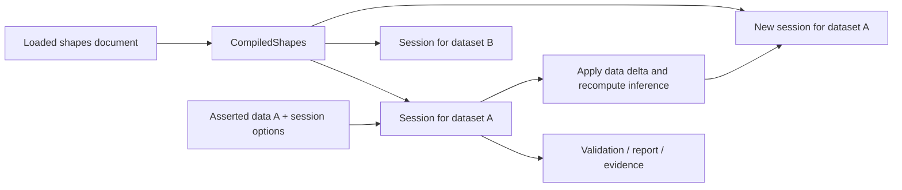

# CompiledShapes and EvaluationSession

Status: proposed implementation plan for 0.5, 2026-09-18.

This develops the ownership changes recommended in the
[architecture review](0.5-architecture-review.md). Names and signatures below
describe the proposed API; they are not implemented yet.

## The two contracts

**`CompiledShapes` owns everything determined by the shapes document.** Compile
once, then reuse it across data graphs. Successful construction guarantees that
the document is valid and that the supported recursion rules have been checked.
It retains both authored meaning and normalized execution structure.

**`EvaluationSession` owns evaluation over one immutable data snapshot.** It
combines compiled shapes, asserted data, inference policy, and graph mode. All
validation views use that same configuration and resulting dataset. Editing data
produces another session that shares the compiled shapes.

Both live in `shifty-engine`. Keep parsing in `shifty-parse`, normalization and
planning in `shifty-opt`, and the IR in `shifty-algebra`. No new crate is needed.



## Ownership and lifetime

| Resource | Owner | Rebuilt when |
| --- | --- | --- |
| Loaded shapes RDF, prefixes, base | CompiledShapes | Shapes change |
| Authored schema and source metadata | CompiledShapes | Shapes change |
| Normalized schema and provenance mappings | CompiledShapes | Shapes change |
| Stratification/admission results | CompiledShapes | Shapes change |
| Function definitions and canonical bodies | CompiledShapes | Shapes change |
| Rule order and conservative read dependencies | CompiledShapes | Shapes change |
| Static physical validation plan | CompiledShapes, created on demand | Shapes change |
| Report/property metadata derived only from shapes | CompiledShapes, migrated incrementally | Shapes change |
| Asserted data and inferred additions | EvaluationSession | Data or session options change |
| Focus graph and evaluation graph roles | EvaluationSession | Data or graph mode changes |
| Frozen dataset and statistics | EvaluationSession, created on demand | Data or graph mode changes |
| Data-sensitive SPARQL plans and result caches | EvaluationSession | Data or execution policy changes |
| Active recursion set and shape memo | One evaluation operation | Each scan/validation/explanation |
| Evidence trees and serialized outputs | Returned result | Requested by caller |

An operation-local memo is intentional for the first implementation. The current
`ShapeEvaluator` borrows its backend and arena; instantiate it locally and reuse
it across the whole operation. Do not introduce self-referential Rust structures
or promise that a conformance scan caches all work for a later explanation.
Persistent boolean/evidence memoization can be assessed separately.

## CompiledShapes

Proposed small construction interface:

```rust,ignore
#[derive(Clone)]
pub struct CompiledShapes {
    inner: Arc<CompiledShapesInner>, // private, cheap clone
}

impl CompiledShapes {
    pub fn compile(source: Loaded) -> Result<Self, CompileError>;
    pub fn diagnostics(&self) -> &[Diagnostic];
    pub fn session(
        &self,
        data: SessionData,
        options: SessionOptions,
    ) -> Result<EvaluationSession, SessionError>;
}
```

`Loaded` remains the existing parser output. Adapters resolve files, URLs,
formats, multi-document merging, and rdflib conversion before this boundary.
Consuming it avoids cloning a potentially large shapes graph. Compilation can
represent an empty schema; a session with Separate input rejects an empty shapes
source, preserving the explicit-shapes input contract. Embedded input is an
explicit session choice and is never inferred from an empty graph. Existing
PreparedValidator constructors retain their earlier empty-input rejection using
the same small input check before compilation.

Compilation performs these steps:

1. Lower the source and call `require_valid()` exactly once.
2. Check authored-arena stratification, using the current polarity-aware
   analysis, because source-oriented consumers can evaluate authored constraints.
   Admission must not depend on which report view is requested. This deliberately
   rejects an invalid recursive authored shape even if normalization could erase
   its use; test and document that stricter boundary.
3. Normalize with mappings. Retain raw-to-normalized shape and statement maps,
   and the inverse statement map used for authored evidence fan-out. Reuse the
   source analysis within normalization where practical; do not recompute SCCs
   for each session. Check the resulting executable arena during compilation too.
4. Compile a function registry from the loaded source, resolving prefixes and
   parameter order once. Move the canonical function-definition representation
   into `shifty-algebra` and its RDF discovery/canonicalization into
   `shifty-parse`; executors consume these definitions. Report and inference
   must stop maintaining independent collectors.
5. Precompute rule ordering and conservative dependencies. Preserve current
   scheduling and wildcard fallbacks. This is extraction of existing work,
   not a change to inference semantics.
6. Retain diagnostics and capability information. Unsupported features remain
   visible regardless of whether a later session chooses Ignore or Error.

Static physical planning should use a private `OnceLock<PhysicalPlan>`. It is
needed by planned validation, but an inference-only caller should not pay for
it. Initially retain the planner's existing arena copy: it preserves shape IDs
while reordering children. Eliminating that copy through a separate ordering
table is a later optimization, not a prerequisite.

Source and normalized arenas are both legitimate. Sharing their owner removes
adapter/session clones without discarding the information evidence and W3C
reporting need. Keep arena access crate-private; give inspection tools borrowed
read-only views as needed. Do not serialize the ownership/cache container as a
new persistent compiled artifact in this change.

## EvaluationSession

```rust,ignore
pub enum SessionData {
    Separate(Graph),
    Embedded, // asserted data initially comes from the compiled source graph
}

pub struct SessionOptions {
    pub graph_mode: ValidationGraphMode,
    pub inference: bool,
    pub engine: EngineOptions,
}

pub struct FindingOptions {
    pub entry_shape_names: Vec<String>,
    pub minimum_severity: Severity,
    pub sort_results: bool,
}

pub struct EvidenceOptions {
    pub findings: FindingOptions,
    pub include_progress: bool,
}

impl EvaluationSession {
    pub fn validate(&self, options: &FindingOptions)
        -> Result<ValidationOutcome, EvaluationError>;
    pub fn report(&self, options: &FindingOptions)
        -> Result<ValidationReport, EvaluationError>;
    pub fn evidence(&self, options: &EvidenceOptions)
        -> Result<EvidenceRun, EvaluationError>;

    pub fn conformance(&self, options: &ConformanceOptions)
        -> Result<ConformanceRun, EvaluationError>;
    pub fn find_failures(&self, options: &ConformanceOptions)
        -> Result<(ConformanceRun, Vec<SelectedPair>), EvaluationError>;
    pub fn explain(&self, pair: &SelectedPair)
        -> Result<Vec<StatementEvaluation>, EvaluationError>;

    pub fn with_delta(&self, delta: &GraphDelta)
        -> Result<Self, SessionError>;
    pub fn data(&self) -> &Graph; // inferred data, excludes separate shapes
    pub fn inferred(&self) -> &[Triple]; // additions relative to asserted data
    pub fn diagnostics(&self) -> &[ExecutionDiagnostic];
}
```

The operations return existing domain results wherever possible. They represent
different useful products and costs: bool/count scans, findings, W3C results,
and full evidence. A universal result object would make that cost less clear.
Existing free functions supply compatibility defaults; the new session API
requires options explicitly at construction.

`ConformanceOptions` stays limited to entry-shape selection. It counts logical
failures without applying severity thresholds or building failure evidence.
`FindingOptions` controls severity-aware validation. Document this distinction:
their `conforms` fields need not agree when a caller chooses a severity threshold
that permits some logical failures. The architecture must not repeat an
unqualified claim that all modes always have identical conformance.

Snapshot-changing options are fixed for the session. Selection, severity, sort
order, and evidence detail can change per operation because they do not change
the dataset or function policy. Existing `ValidationOptions.engine` maps into
session construction through compatibility adapters; there must not be two
competing engine policies in a single session.

Construction admits the requested policy, computes inference when enabled, and
retains its diagnostics and additions. A session with no executable rules does
not encode source storage until validation first needs it. Active inference
builds one dictionary-encoded dataset, commits rule batches to it, and carries
it into validation. The physical validation plan is still lazy.

Internally use shared ownership for the asserted graph and lazy evaluated-data
compatibility projection. With inference off, both refer to the same graph.
Compiled inference keeps a growing evaluated-data graph while rules execute,
then retains the dataset; it reads the data/shapes union through that dataset
and builds no full-data Oxigraph Store or materialized union graph. A public
evaluated-data getter projects the data membership once on demand.
Legacy inference retains its graph context. `SparqlExecutor` owns query caches
and temporarily owns the dataset during inference; the session receives that
dataset on publication and moves it into prepared validation on first use.

Keep the current thread confinement of `Rc`/`RefCell` executor state. Target
`CompiledShapes: Send + Sync`, verify that with a compile-time assertion, and
create separate sessions per worker. Do not make sessions thread-safe by adding
locks to hot paths as part of this refactor. Python prepared validators can
construct and consume a session within their existing detached Rust call;
persistent evidence sessions remain thread-confined.

## Graph roles: one private constructor

Let `S` be the fixed shapes source, `D` asserted data, and `E` data after optional
inference. A private context builder implements this entire table:

| Input | Mode | Focus candidates | Default evaluation graph | Named `$shapesGraph` |
| --- | --- | --- | --- | --- |
| Separate | Data | E | E | S |
| Separate | Union | E | E union S | S |
| Separate | UnionAll | E union S | E union S | S |
| Embedded | Any | E | E | S |

The focus view supplies candidates; selectors such as `targetNode` still keep
their current semantics for explicit terms absent from the graph. Compiled
validation, reporting, and evidence use a graph-scoped focus interface over
the dataset, including UnionAll focus discovery. A UnionAll compatibility
`Graph` is materialized once only if its public getter is called.

For split inputs, inference continues to discover rule foci from data while
reading `D union S`, independently of validation graph mode. For embedded inputs,
inference reads the evolving data graph. Preserve this existing distinction;
changing validation mode must not silently change rule inference.

The named shapes graph is always the compiled source. This fixes UnionAll
leakage and makes embedded behavior explicit: inferred triples are data, and do
not silently change the named shapes graph or compiled shapes. Embedded callers
that previously observed inferred triples through `$shapesGraph` will see a
behavior change; cover it in tests and release notes.

All SPARQL executors, including the inference executor, receive the canonical
function registry, engine policy, and named-shapes binding through this shared
setup. Target and constraint query capabilities must both inform dataset needs.
Register functions before creating prepared queries or populating caches.

A compatibility wrinkle is that legacy inference discovers function definitions
in its entire context graph, including separate data. The new facade defines
functions in the compiled shapes source. Retain legacy context discovery only
in the low-level compatibility path until that behavior is explicitly deprecated;
do not claim arbitrary `Schema + Graph` callers can immediately become wrappers
around document compilation. Add a regression case for the distinction.

## Errors, diagnostics, and identifiers

- `CompileError`: invalid lowering/query definitions or non-stratifiable schema.
  Preserve structured diagnostic/source information.
- `SessionError`: invalid input mode (including empty explicit shapes), policy
  admission, or inference preparation failure. In the new
  API, a strict unsupported rule execution fails session construction instead of
  exposing a partially inferred graph as a successfully prepared session. This
  is an explicit strict-policy correction; legacy standalone inference can keep
  its diagnostic-bearing result contract through its compatibility wrapper.
- `EvaluationError`: invalid/foreign handles or an operation that cannot complete.
  Existing SPARQL constraint execution failures can remain diagnostic-bearing
  failures in validation results; do not turn ordinary nonconformance into an
  exception or silently turn query errors into success.
- Ignored unsupported features and best-effort inference diagnostics remain
  inspectable. Python/CLI/C++ adapters must expose substep diagnostics rather
  than discard them. Preserve existing result fields and add diagnostic access
  where a binding has none.

Preserve authored and normalized IDs and their current serialized meanings.
Resolve entry-shape selection against authored identities before normalization
fan-out, so selecting one named shape cannot pull in another merely because CSE
merged their expressions.

New-session `SelectedPair` handles carry a private snapshot identity token as
well as normalized statement, focus, and selected authored statements. `explain`
rejects handles from another session, even one sharing `CompiledShapes`. Use an
owned identity token, not a raw address vulnerable to reuse. These are in-process
handles, not a new portable serialization format. Legacy unchecked handle APIs
can continue through compatibility code until migrated.

## Data edits and repair

`with_delta` patches **asserted data**, then repeats session preparation under
the same graph mode and engine/inference policy. It shares `CompiledShapes` and
gets fresh dataset/query caches and a fresh snapshot identity. Deleting the last
support for an inferred triple must remove that conclusion from the new session.
The original session and any returned results remain valid.

It never patches the compiled source. With split inputs, deleting a data triple
also present in `S` leaves the shapes copy visible in union evaluation. Embedded
revalidation patches its data role and evaluates `E` directly, so original data
facts are not accidentally reintroduced by unioning the old source document.
Changing shape definitions requires explicitly compiling a new source document.

Implement the new repair gate as a separate repair operation over a session:
validate the whole baseline, create `with_delta`, validate the whole candidate,
then diff failures. Reuse the existing gate's focus/statement identity contract.
It must not accidentally inherit a UI's filtered entry-shape selection. The new
gate inherits the session's inference policy so its verdict describes the graph
that ordinary validation will see.

Keep legacy `revalidate(infer=False)` and `RepairSession.advance` behavior explicit
during migration: those may patch materialized data without recomputing inference.
Use a private compatibility path for that contract; do not silently implement
them as the new `with_delta`. A later public deprecation can move callers to the
asserted-data contract. Caller-owned rdflib write-back remains in Python and uses
only the successful session's inferred delta, preserving blank-node identity.

The current Python `RepairSession` remains a sendable `pyclass` and releases the
GIL while gating. It retains the compiled source and asserted graph, but cannot
retain the thread-confined `EvaluationSession` across that boundary. Each gate
therefore prepares a fresh baseline session and a patched candidate. Source
encoding and source indexes are still shared by `CompiledShapes`; local session
preparation is repeated. This is an explicit adapter cost, not an engine storage
requirement. `EvidenceSession`, which is unsendable, retains its prepared session
and uses `with_delta` for ordinary revalidation.

## Reporting and result ownership

Initially `session.report()` uses the existing Reporter with compiled source
metadata and the session's executor/context. This centralizes admission, graph
roles, function registration, and policy immediately. Reporter must borrow those
resources rather than rebuild its own executor.

That first step still has two semantic evaluators. The later reporter migration
requires lowering metadata for authored component boundaries, source shape,
original result path, severity/messages, and nested property ownership. Existing
`Schema::sources` and normalization maps are useful but insufficient to recover
all that after optimization. Design those records in the parser, keep their
mapping in `CompiledShapes`, and make Reporter consume shared judgments one
component at a time.

Start with owned existing result structs. Bindings may keep a cheap compiled
handle alongside a result for descriptions and repair. Serialize only when asked.
Lazy shape-map projections may retain a session explicitly; plain validation
results should not retain an entire dataset merely to render a message. Do not
bundle a new evidence DAG, compact format, or shape-map rewrite into initial
session extraction.

## Files and migration

Add three private implementation modules, with the two principal types and their
options/errors re-exported from `shifty-engine`:

- `compiled.rs`: shared source/IR ownership, admission, provenance, lazy plan,
  compiled rule metadata.
- `session.rs`: public operations, preparation sequencing, data edits, snapshot
  identity, and diagnostics.
- `context.rs`: embedded/split graph-role assembly and executor construction.

Keep semantic algorithms in their current modules. Give `validate`, `evidence`,
and `report` crate-private functions that accept prepared resources. A generic
plugin interface, builder hierarchy, or public backend-selection trait is not
needed for this change.

| Existing entry point | Migration |
| --- | --- |
| Python/C++ PreparedValidator | Retain one CompiledShapes handle; create sessions per data input |
| Python/C++ EvidenceSession | Retain an EvaluationSession; use compiled provenance directly |
| Top-level validate/validate_algebra | Load, compile, create session, select result, adapt |
| Top-level infer | Load, compile, create session with inference enabled, return data/delta/diagnostics |
| CLI/Wasm validation and inference | Same sequencing; keep transport, display, profiling presentation outside |
| PreparedValidator property witnesses | Existing projection consumes compiled source plus session resources |
| RepairSession/gate | Move to session resources while preserving explicit legacy edit behavior |
| Rust APIs accepting Schema/PhysicalPlan/context | Keep advanced compatibility entry points; share drivers/context helpers without inventing lost source RDF |
| CLI inspect and optimizer differential tests | Retain direct parse/normalize/plan stages and the unoptimized execution path |

## Implementation slices and acceptance criteria

### 1. Pin the contracts and four reported regressions

Add shared small RDF fixtures for negative recursion, pure function registration,
UnionAll `$shapesGraph`, and strict inference within validation. Pin expected
behavior with tests attached to each fix so intermediate commits stay green.
Add embedded/split graph-role cases and explicit defaults to the API docs.

### 2. Extract CompiledShapes

Implement ownership, admission, canonical function compilation, mappings, rule
metadata, and lazy planning. Keep old paths operational. Prove that two datasets
share one compiled object, that repeated preparation does not lower/normalize
again, and that inference-only use does not construct a validation plan.

### 3. Implement EvaluationSession and route engine operations

Extract context assembly and parameterize inference by the compiled registry and
policy. Add lazy indexing, local evaluators, typed diagnostics, and identity
checks. Move the evidence preparer's source/normalized ownership into
CompiledShapes and route algebra/report/evidence through the prepared resources.
Share the duplicated validation driver while retaining distinct raw/planned
focus enumeration for differential checks.

Acceptance: the four review discrepancies are fixed through the new API;
interleaved operations and differently configured sessions do not contaminate
each other's caches. Bare conformance still materializes no evidence.

### 4. Migrate bindings and frontends

Move Python first, then C++ and CLI/Wasm, in independently reviewable commits.
Remove their duplicated compile/inference setup after each adapter has parity.
Test both top-level and prepared APIs. Preserve outputs, blank-node write-back,
severity behavior, and authored identity except the listed correctness fixes.
Expose retained diagnostics in each frontend.

### 5. Add session edits and integrate repair

Implement `with_delta`, stale-handle rejection, and whole-session repair gating.
Test addition and deletion through inference, preservation of the original
session/results, embedded data edits, and data/shapes overlap. Test compatibility
methods separately so their materialized-data semantics remain intentional.

### 6. Remove redundant ownership and document the stable facade

Remove duplicate adapter schemas/maps, old preparation branches, and eager JSON
from migrated result paths. Keep useful compatibility wrappers and inspect APIs.
Document supported thread usage, lifecycle costs, graph roles, diagnostics, and
identity scopes. Defer full W3C semantic unification and typed shape-map extraction
to follow-up changes with their own acceptance criteria.

For 0.5, completion means both abstractions are used by all document-based
frontends, the four reproduced bugs are fixed there, and the lifecycle/edit
contracts have tests. Adding types while leaving the existing preparation paths
active would not meet the goal.

## Verification during implementation

Use behavior tests for graph roles, inference, recursion, severity, source/CSE
selection, and cross-interface parity. A few test-only counters for compilation,
planning, and index construction can enforce the reuse contract; avoid timing
assertions. Compare representative small, Brick, and s223 workloads for cold
compile, reuse across datasets, repeated session operations, and revalidation.
Measure peak memory as well as latency; sharing the arenas should not accidentally
retain a new full graph/index copy in every result.

Run the existing Rust CI gates (`cargo fmt --all -- --check`, workspace Clippy
with warnings denied, and workspace tests), C++ CMake/CTest gates, and the existing
Wasm build/smoke workflow as the affected adapters migrate. For Python changes,
use `uv sync --dev --frozen` in `python/`, format with `uv run ruff format .`, then
run the repository-required Ruff checks, `uv run ty check shifty`, and
`uv run pytest -q`. No implementation tests have been run for this design-only
document.
