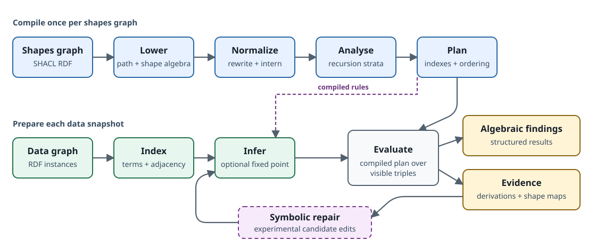

How shapes are compiled
=======================

Most SHACL validators walk the shapes graph at validation time: for each focus
node, look up its constraints in RDF, dispatch on the constraint component,
recurse. It is a direct reading of the specification and it works.

Shifty does something else. It compiles the shapes graph into an algebra
first, optimizes that, plans it, and only then looks at any data. This page
explains what the algebra is and what the compilation buys.

The short answer is that SHACL's vocabulary is much larger than its semantics.
There are dozens of constraint components, and a validator that dispatches on
all of them has dozens of code paths to keep consistent — and every new
capability, like evidence or repair, has to be implemented dozens of times.
Reduce the vocabulary to a handful of operators first, and each capability is
written once.

The core algebra
----------------

The IR comes from the SHACL fragment of `Common Foundations for SHACL, ShEx,
and PG-Schema <https://arxiv.org/abs/2502.01295>`_ (Ahmetaj et al.),
specialized to RDF. It has two parts.

**Paths (π)** — a Kleene algebra with converse, denoting a relation over terms:

.. code-block:: text

   π ::= id | q | π⁻ | π · π′ | π ∪ π′ | π*

Identity, a predicate, inverse, sequence, alternation, and reflexive-transitive
closure. SHACL's ``zeroOrMorePath`` is ``π*``; ``oneOrMorePath`` is ``π · π*``
and ``zeroOrOnePath`` is ``π ∪ id``, both normalized away in the parser rather
than carried as IR constructors.

**Shapes (φ)** — a boolean algebra over a small set of atoms:

.. code-block:: text

   φ ::= ⊤ | test(c) | test(τ) | closed(Q) | eq(π,p) | disj(π,p)
       | ¬φ | φ ∧ φ′ | φ ∨ φ′ | ∃≥ⁿ π.φ | ∃≤ⁿ π.φ

``test(c)`` is equality with a constant, ``test(τ)`` is membership in a value
type, and the two counting forms are lower and upper bounds on how many
π-successors satisfy φ. Shifty adds a few operators the paper's core does not
have but real SHACL needs — node kinds, ``lessThan``, ``lessThanOrEquals``,
``uniqueLang`` — and fuses the two counting forms into one ``Count`` node with
optional ``min`` and ``max``, because real SHACL always emits them as a pair on
a shared path and qualifier.

A **schema** is a set of ``(selector, φ)`` statements. The selector is the
target: which nodes to check. The graph conforms when every node a selector
picks satisfies the corresponding φ.

One counting primitive
~~~~~~~~~~~~~~~~~~~~~~

The single most useful consequence is that ``Count`` subsumes a large slice of
the SHACL vocabulary. ``sh:minCount`` and ``sh:maxCount`` are counts. Qualified
cardinality is a count with a non-trivial qualifier. ``sh:node`` and
``sh:property`` nesting is a count along a path. And universal quantification
— "every value of this path satisfies φ", which is what ``sh:datatype`` on a
property shape means — is:

.. code-block:: text

   ∀π.φ  ≜  ∃≤0 π.¬φ

"at most zero π-successors fail φ". So the planner optimizes one construct
rather than a dozen vocabulary terms, and evidence, repair, and the cost model
each need one case for all of them.

This encoding is visible in validation results. A ``sh:datatype`` violation is
reported as a ``CountHigh`` against a ``max 0`` that does not appear explicitly
in the shapes graph. See :doc:`../tutorials/explaining-a-failure` for a worked
example and :doc:`../reference/python` for the structured result fields.

The pipeline
------------

   Compilation is paid once per shapes graph. Prepared validators reuse the
   compiled plan across data graphs.

``shifty inspect --stage <stage>`` prints the output of each layer; see
:doc:`../how-to/inspect-pipeline` for worked output.

**Parse (``rdf``).** The shapes graph as triples.

**Lower (``algebra``).** SHACL vocabulary becomes π and φ. Shapes go into an
arena and refer to each other by index, so a shared sub-shape is one node with
several parents, and cyclic references are representable rather than an
infinite structure.

**Normalize (``normalized``).** Semantics-preserving rewrites. The enabler is
hash-consing: structurally identical nodes are interned to one, which makes
sharing explicit and equality a pointer comparison. On top of that sit the
boolean laws (flattening, ⊤/⊥ absorption, idempotence, complementation, and
negation-normal form), the counting laws (unsatisfiable bounds collapse to ⊥,
counts on the same path and qualifier merge, an ``id`` path collapses the count
away), the path laws (``π·id = π``, ``(π⁻)⁻ = π``, converse pushed down to
wrap only predicates, ``(π ∪ id)* = π*``), and value-type tightening — merging
overlapping ranges, and detecting contradictions like a numeric range conjoined
with ``xsd:string``, which becomes ⊥ and then absorbs upward.

Each rewrite is checked against the unoptimized evaluator as an oracle: the
normalized schema and the original must agree on conformance and on which foci
violate.

**Analyse recursion (``strata``).** The shape dependency graph is built with
polarity-aware edges and condensed into strongly connected components. A schema
whose recursion passes through a negation is refused. :doc:`recursion` covers
this.

**Plan (``plan``).** Two decisions. Focus nodes are seeded from an index rather
than a scan — ``sh:targetClass ex:Person`` becomes a lookup along
``rdf:type/rdfs:subClassOf*``. And conjunctions are reordered by estimated
cost, so a cheap discriminating check runs before an expensive one and
short-circuits it.

**Execute.** The plan runs over an indexed dataset. SPARQL constraints are
classified by whether they can be executed natively against those indexes or
need a general SPARQL engine; ``inspect --stage capability`` reports which.

**Infer.** SHACL-AF rules are a separate machine — bodies are condition shapes
plus a selector, heads are triples built from node expressions — evaluated to a
fixed point before validation, over the same arena and the same stratification.

Why one IR matters
------------------

The pipeline is the visible payoff, but the structural one is that validation,
inference, evidence, and repair are all folds over the same arena.

Validation is a fold computing a boolean. Evidence is a fold computing a proof
tree — same traversal, same memo, richer result. Repair is a fold over that
proof tree in the opposite direction: to describe how to fix ``φ₁ ∧ φ₂`` you
need the repair spaces of both conjuncts, which is exactly what a fold gives
you. The shape enum has around fifteen variants and is already in
negation-normal form, so each of these folds is a manageable match rather than a
sprawl.

This is why the interfaces cannot disagree about whether a graph conforms.
Evidence uses the validation evaluator as its oracle; the repair gate is the
validator run again over a proposed edit. There is no second implementation of
SHACL to drift.

It also explains the shape of the limitations. Repair is undefined for
``sh:sparql`` not because nobody has written that case yet, but because an
arbitrary SPARQL query is opaque to the algebra — there is nothing to fold
over. The features that are hard are exactly the ones that escape the IR.

What the compilation costs
--------------------------

Compiling is a fixed cost paid before any data is looked at, and for a large
ontology it is substantial. A 16-triple Brick model still takes seconds to
validate against a 229k-triple shapes closure, essentially all of it setup.

That is fine when the schema is reused and terrible when it is not. It is why
``PreparedValidator`` exists, why the evidence and repair sessions are objects
you hold rather than functions you call, and why the benchmark chart in
:doc:`benchmarks` separates setup from the rest — a release that halves
validation time is invisible in the total if setup dominates.

Further reading
---------------

The design documents in ``development_docs/`` are the primary sources:
``00-formalism.md`` fixes the IR, ``03-recursion-semantics.md`` the recursion
decision, ``04-normalization.md`` the rewrite checklist with soundness notes,
``05-sparql-execution.md`` the native SPARQL subset, and ``06-repair.md`` the
repair API.
