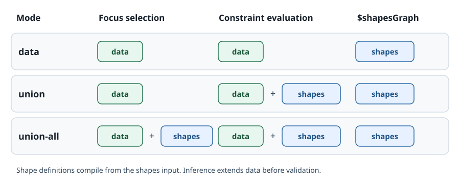

Shapes graphs and data graphs
=============================

.. _shapes-and-data-graphs:

Shifty controls the source of shape definitions separately from the triples
available during evaluation:

1. Where do **shape definitions** come from?
2. Which triples are **visible during evaluation**?

The inputs determine where shapes come from. ``graph_mode`` determines which
triples are visible to validation.

Where shapes come from
----------------------

The rule is the same in every frontend.

With a single graph, Shifty reads both shape definitions and data from it.
This supports combined files, where ``sh:NodeShape`` definitions sit alongside
instance data.

With separate shapes and data inputs, Shifty compiles the schema only from
the shapes graph. SHACL vocabulary in the data graph, such as ``sh:property``
or ``sh:NodeShape``, does not contribute constraints.

.. list-table::
   :widths: 45 25 30
   :header-rows: 1

   * - Invocation
     - Shapes read from
     - Data read from
   * - ``shifty.validate(combined)`` / ``shifty.validate(combined, None)``
     - the one graph
     - the one graph
   * - ``shifty.validate(data, shapes)``
     - ``shapes`` only
     - ``data`` only
   * - ``shifty validate --shapes combined.ttl``
     - the one graph
     - the one graph
   * - ``shifty validate --shapes shapes.ttl --data data.ttl``
     - ``--shapes`` only
     - ``--data`` only

Why the asymmetry
~~~~~~~~~~~~~~~~~

Data graphs may include shapes copied from examples or supplied by an
upstream exporter. Reading those as constraints would change the validation
schema whenever the data changed. Keeping shape definitions in the supplied
shapes graph makes the schema predictable and matches SHACL's separation of
shapes and data.

Shapes embedded in data
~~~~~~~~~~~~~~~~~~~~~~~

Both ``--shapes`` and the Python ``shapes`` argument accept multiple sources
and union them. To include shapes embedded in data, add the data file as a
shapes input:

.. code-block:: bash

   shifty validate --shapes shapes.ttl --shapes data.ttl --data data.ttl

.. code-block:: python

   conforms, report, text = shifty.validate(data, [shapes, data])

To validate a combined graph in Python, omit the second argument or pass
``None``. An explicitly supplied shapes graph that contains no triples raises
``ValueError``, preventing an accidental vacuous validation from being reported
as successful.

.. code-block:: python

   shifty.validate(combined)              # combined is both
   shifty.validate(combined, None)        # same
   shifty.validate(combined, rdflib.Graph())   # ValueError: empty shapes graph

This guard applies only when the supplied shapes graph has zero triples. A
nonempty schema whose targets select no focus nodes remains a valid conforming
run.

Which triples are visible
-------------------------

The second question is entirely separate, and applies *after* the schema is
fixed. It is controlled by ``graph_mode`` (``--graph-mode`` on the CLI), and it
governs both where focus nodes are selected and what path traversal,
class-hierarchy lookup, and SPARQL can see.

   Graph visibility with separate shapes and data inputs. Inference extends the
   data side before validation; ``$shapesGraph`` keeps naming the shapes source.

.. list-table::
   :widths: 20 35 45
   :header-rows: 1

   * - Mode
     - Focus selection
     - Evaluation graph
   * - ``data``
     - Data
     - Data
   * - ``union`` *(default)*
     - Data
     - Data ∪ shapes
   * - ``union-all``
     - Data ∪ shapes
     - Data ∪ shapes

The default is ``union`` because of class hierarchies. ``sh:class ex:Sensor``
has to hold for an ``ex:TemperatureSensor`` when the ontology says
``ex:TemperatureSensor rdfs:subClassOf ex:Sensor`` — and that axiom is almost
always authored with the shapes, not with the instance data. Under ``data``
mode the validator cannot see it, and every subclass instance fails a
constraint it satisfies.

Use ``data`` to check whether the data graph is self-contained, including its
ontology definitions. The default, ``union``, validates nodes selected from the
data graph with vocabulary from both graphs. ``union-all`` also
selects focus nodes from the shapes graph, which is useful when the shapes file
contains instances you intend to validate too. It can also select ontology
resources in the shapes graph as validation targets.

``infer()`` takes no ``graph_mode``. Graph modes describe what validation can
see; inference derives additions to the data graph. With separate inputs, rules
can read the data and shapes graphs while selecting their focus nodes from data.
With combined input, rules read the evolving data graph.

SPARQL ``$shapesGraph`` always names the original shapes source. It does not
grow when inference adds data triples, even when one input file supplies both
shapes and data. To change the named shapes graph, compile a new shapes source.

Note that expanding the evaluation graph can flip a result in either direction.
It usually makes a constraint easier to satisfy — more triples to traverse —
but it also gives ``sh:closed`` more predicates to object to, and gives
``sh:maxCount`` more values to count. Widening the graph is not monotonically
more permissive.
