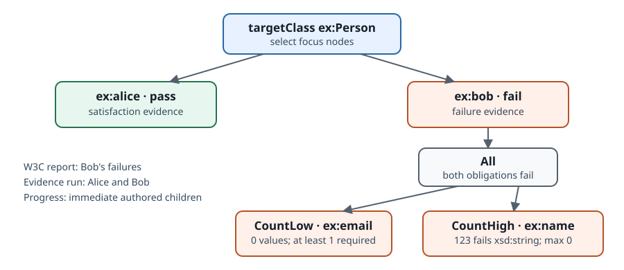

Explain a validation result
===========================

A validation result lists failures, but does not identify passing nodes or
retain the derivation behind a failure. The evidence interface provides both.

Set up
------

Use the failing version of ``data.ttl`` from the first tutorial, so there is
something to explain:

.. code-block:: turtle

   @prefix ex: <http://example.org/> .

   ex:alice a ex:Person ; ex:name "Alice" ; ex:email "alice@example.org" .
   ex:bob   a ex:Person ; ex:name 123 .

``shapes.ttl`` is unchanged.

Inspect the validation evidence
-------------------------------

Open an evidence session over the two graphs and validate:

.. code-block:: python

   import pathlib
   import shifty

   shapes = pathlib.Path("shapes.ttl").read_text()
   data = pathlib.Path("data.ttl").read_text()

   session = shifty.EvidenceSession(shapes, data, infer=False)
   run = session.validate()

   print("conforms:", run.conforms)
   for statement in run.statements:
       print(statement.selector, "selected", len(statement.selected_foci))
       for focus in statement.selected_foci:
           print("  ", focus.status, focus.focus)

.. code-block:: text

   conforms: False
   class(ex:Person) selected 2
      pass <http://example.org/alice>
      fail <http://example.org/bob>

The evidence includes Alice even though the validation report did not. A
statement whose target selected nothing has an empty ``selected_foci`` list. A
selected node has ``status == "pass"`` or ``status == "fail"`` according to its
validation result.

   The report lists Bob's failures. Evidence also records Alice's pass and the
   nested reasons for Bob's failure.

Now ask why Bob failed:

.. code-block:: python

   for statement in run.statements:
       for focus in statement.selected_foci:
           if focus.status == "fail":
               print(focus.evidence.explain())

.. code-block:: text

   All — fix every:
     All — fix every:
       CountHigh along ex:name: 1 match(es), max 0
         value "123"^^<http://www.w3.org/2001/XMLSchema#integer>:
           Atom at "123"^^<http://www.w3.org/2001/XMLSchema#integer> via ex:name [cuttable]
     CountLow along ex:email: have 0, need 1

The tree follows the constraint structure. The outer ``All`` combines Bob's
two property obligations: both failed, and both must be fixed. The
``CountLow`` branch records the missing email as a count: zero values found,
one required.

The ``CountHigh`` branch appears even though ``shapes.ttl`` does not declare a
maximum. ``sh:datatype`` constrains *every* value of ``ex:name``, and "every
value satisfies φ" is compiled as "at most zero values satisfy ¬φ". A
universal constraint therefore appears as a count with ``max 0``; its "match"
is the value that violates the datatype constraint. The
:doc:`architecture explanation <../explanation/architecture>` describes this
encoding.

``[cuttable]`` is the engine noting that this leaf rests on a concrete triple —
one that could be pointed at, or removed, to change the outcome. Leaves that
have no such finite support say so instead; :doc:`../explanation/recursion`
covers the case where that happens.

``explain()`` produces text for humans. Programs should use ``walk()``,
``constraint_kind``, and the structured projections described in
:doc:`../reference/evidence`. Evidence is canonical: a failed conjunction keeps
the children that establish the failure and drops passing siblings.
``focus.progress`` contains the immediate authored siblings and their statuses.

Inspect a passing node
----------------------

Alice conforms. Use the evidence projections to retrieve the values and
triples that satisfied her constraints. These methods work on both passing
and failing evidence:

.. code-block:: python

   for statement in run.statements:
       for focus in statement.selected_foci:
           evidence = focus.evidence
           print(focus.status, focus.focus)
           print("   matched: ", evidence.matched_values())
           print("   support: ", evidence.supporting_triples())

.. code-block:: text

   pass <http://example.org/alice>
      matched:  ['"Alice"', '"alice@example.org"']
      support:  ['<http://example.org/alice> <http://example.org/name> "Alice"',
                 '<http://example.org/alice> <http://example.org/email> "alice@example.org"']
   fail <http://example.org/bob>
      matched:  ['"123"^^<http://www.w3.org/2001/XMLSchema#integer>']
      support:  ['<http://example.org/bob> <http://example.org/name> "123"^^<http://www.w3.org/2001/XMLSchema#integer>']

``matched_values()`` returns Alice's name and email, the values that satisfied
her constraints. ``supporting_triples()`` returns the supporting triples in
N-Triples form.

Bob also has matched values: the values counted by the constraint. For his
``max 0`` datatype check, this is the integer that failed the datatype test.
Use the failure projections to retrieve offending values and missing counts:

.. code-block:: python

   for statement in run.statements:
       for focus in statement.selected_foci:
           if focus.status != "fail":
               continue
           print("offending:", focus.evidence.offending_values())
           for gap in focus.evidence.missing_obligations():
               print(f"need {gap.missing} more: "
                     f"observed {gap.observed_count}, required {gap.required_count}")

.. code-block:: text

   offending: ['"123"^^<http://www.w3.org/2001/XMLSchema#integer>']
   need 1 more: observed 0, required 1

``gap.missing`` is an integer, so a repair tool or data-entry form can use it
directly to determine how many values are needed.

See the siblings a proof leaves out
-----------------------------------

Bob's failure tree omits passing children. To show the status of all
immediate authored children, including passing ones, use ``focus.progress``:

.. code-block:: python

   for statement in run.statements:
       for focus in statement.selected_foci:
           if focus.progress is None:
               continue
           print(focus.focus)
           for child in focus.progress.evaluated_children:
               print("   ", child.source_constraint_ref,
                     child.constraint_kind, child.status)

.. code-block:: text

   <http://example.org/alice>
       1 ConstraintKind.Conjunction pass
       8 ConstraintKind.Cardinality pass
   <http://example.org/bob>
       1 ConstraintKind.Conjunction fail
       8 ConstraintKind.Cardinality fail

Progress records each child's status without building its derivation. To
retrieve the full evidence for a child, call ``evidence_for``:

.. code-block:: python

   detail = session.evidence_for(focus.focus, child.normalized_constraint_ref)
   print(detail.status, detail.evidence_kind)

Canonical evidence explains why a result holds. Progress reports the status of
the immediate authored children. ``evidence_for`` materializes the derivation
for one child on demand.

Evidence guarantees and cost
----------------------------

The evidence interface retains the validator's derivation. It uses the same
SHACL evaluation as ``validate()``, with a richer return value from the same
fold.

Generating evidence requires additional work to retain each derivation. If you
need only failure explanations, use ``find_failures()`` followed by ``explain()``
for each pair. See :doc:`../explanation/performance` for entry-point guidance.

Related documentation
---------------------

- :doc:`../how-to/shape-maps` — the same bindings as a flat table, for when a
  shape is really an extraction schema.
- :doc:`../reference/evidence` — the exact data model, for building on.
- :doc:`../explanation/evidence-design` — the evidence model and its limits.
- :doc:`../how-to/repair` — **experimental**: failure evidence is also the
  input to a symbolic repair layer that computes which edits would make a node
  conform. It is early and its API is expected to change.
